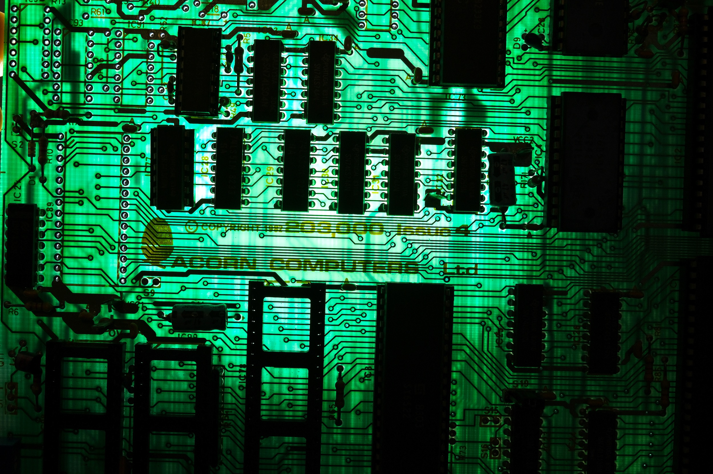

# Pimp My Beeb

BBC Micro inside a open-frame ATX PC case 

!!MEDIA TODO: Photo of completed build, big wood tabletop, HDMI monitor, modern wireless mechanical keyboard, mouse, and Xbox Series X gamepad.

!!MEDIA TODO: GIF clip of the machine in action. overview, power up, closeup of animated backlit motherboard, using modern input devices.

## Highlights

* Fully functional BBC Micro inside open-frame ATX PC case

* Animated RGB Backlight

* Working dual full-height 5.25" Floppy Drives

* USB keyboard and gamepad ([via USB4VC](https://github.com/dekuNukem/USB4VC/blob/master/README.md))

* HDMI video out ([via RGB2HDMI](https://github.com/hoglet67/RGBtoHDMI))

* SD card support (TurboMMC)

* Working soft power and reset button

## BBC Micro: (A quick) Introduction

### History and Legacy

* In early 1980s, British Broadcasting Corporation(BBC) started the *Computer Literacy Project*, aiming to introduce people to computers and show what they can do.

* **[Acorn Computer](https://en.wikipedia.org/wiki/Acorn_Computers)**'s design won out, and was developed into **[BBC Microcomputer](https://en.wikipedia.org/wiki/BBC_Micro)**, often nicknamed the "**Beeb**".

* BBC Micro was featured heavily in [TV programmes](https://en.wikipedia.org/wiki/The_Computer_Programme), and became ubiquitous in education environments in UK.

* A common sight in school computer labs, it introduced a whole generation to computing, and inspired many bright minds.

* Acorn went on to develop the **Acorn RISC Machine**, or [ARM](https://en.wikipedia.org/wiki/ARM_architecture_family) in short (Yes, *that* ARM), which are now found in virtually all smartphones, 32-bit microcontrollers, and even desktop PCs.

* It might be relatively unknown outside UK, but BBC Micro holds a significant place in computer history, as well as nostalgia in many peoples hearts!

### Specifications

### Trivias

## Oh no! You butchered a piece of important computer history!

First of all, all modifications here are **non-destructive and reversible**. So no Beebs were harmed during the creation of this project!

What's more, modifying BBC Micros was not unheard of even back then! One great example is the original [Torch Communicator](https://en.wikipedia.org/wiki/Torch_Computers):

A sleek business machine running CP/M with integrated display, keyboard, and disk drives. What's not to like?

At this point, eagle-eyed viewers might notice the UI looks suspiciously familiar! The secret is revealed looking inside the case [thanks to this video](https://www.youtube.com/watch?v=pNdYtTvEAQs):

Yep, they literally nicked the motherboard from a BBC Micro and built their own computer around it!

Despite the humble root, the Torch Communicator was a fairly advanced machine, having a Z80 co-processor running CP/M with networking capabilities, and it was the [first microcomputer](https://nosher.net/archives/computers/micro_decision_1982-05_002) to be fully approved by British Telecom to connect to the telephone and Telex network, in 1982!

Torch Computer went on to develop their [own machines](https://en.wikipedia.org/wiki/Torch_Computers#Torch_Triple_X) later. But this is a great example of building upon an existing computer to expand its capabilities.

## The FrankenBeeb

Of course, Beeb tinkering did not stop with commercial companies, plenty enterprising users had a go as well!

Here is a machine I picked up locally via ebay:

It's a Beeb with ... a separate keyboard and boxy case??

The top half of the Beeb was replaced with a flat lid. And the keyboard is in its own metal enclosure with a ribbon cable (???).

The new boxy case most likely allows the computer, disk drive and monitor to be stacked on top each other, saving valuable desk space.

A look inside revealed big upgrades, fully kitted out with sidewise expansion card, floppy disc controller, battery backup, a standalone audio jack, and speech synthesis chips. And just look at all the ROMs!

The disc drive features dual-80 track full height floppy drives, with some notes on the door:

There is no brand name or identifying information on any of the modifications, which led me to assume that the whole thing was home-made or at least from a kit.

Either way, it looks very professionally done, and is a seriously impressive feat of how far people would go to personalize their computers to their exact liking.

I removed the RIFA caps from the PSU, took lots of photos for documentation, cleaned up the PCB, and tested it out. It actually works! Look at the huge list of ROMs:

The disc drive works too! I decided not to risk its original power supply, and powered the drives with a modern ATX PSU. The FrankenBeeb read the discs just fine:

As you can see, it's quite a mess indeed. It was at this point that an idea occurred to me:

***Wouldn't it be nice if all those can go into a single ATX PC case?*** 

This way,

* Everything's in one place, cleaner look.

* Interesting juxtaposition between 40-year-old hardware and modern case.

* Very much in the spirit of wacky modding of the era.

* Honestly, why not?

## A Happy Coincidence?

Obviously, the most important part is mounting the motherboard. So I found a spare and did some measurements.

Imagine my surprise when it turns out the BBC micro motherboard is **almost identical in size** as full-size ATX!

Either it's one hell of a coincidence, or Acorn was so ahead of its time that it predicted ATX form factor by **14 years**!

Still in disbelief, I placed the BBC motherboard inside a ATX case, and low and behold:

It fits almost perfectly! The RGB, cassette, serial, composite and RF ports line up with the I/O window, and there are space for all the connectors in the back! This is almost too good to be true.

Although in this particular case(!!), the PCI bracket is blocking the analogue and econet port, and the long 5.25" drive doesn't go all the way in.

Which brings us neatly to the next part: What case *should* I use?

## Case Selection

Initially, I wanted one of those absolutely obnoxious gaming cases kitted out with RGB straight out of [r/pcmasterrace](https://old.reddit.com/r/pcmasterrace/), just for maximum hilarity. Something [like this:](https://old.reddit.com/r/gamingpc/comments/jb8w25/just_rgb_everything/
)

So I went to look for a case that's:

* Available new

* Full size ATX or larger

* Gaming aesthetics (RGB, Glass panel, etc)

* Has 5.25" bays for two full-height disk drives

It didn't seem like a tall order, but after sifting through dozens of pages on amazon and newegg, I came to the devastating conclusion such case ***simply does not exist anymore***.

As you can see, apparently 5.25" bays just isn't thing anymore! Instead there is a blank space where it used to be, to the horror of *dozens* of retro modding enthusiasts.

(yes I know there's a case with 2 bays right in that photo, but I need 4 for two drives)

-----

Just when I thought modern cases were a lost cause, I stumbled upon something I completely missed: **open-frame cases**!

Some of them are just scaffolding for mining rigs, but one in particular really caught my eye, the [Thermaltake Core P3 TG Snow](https://uk.thermaltake.com/core-p3-snow-edition.html):

* I really like its striking yet minimalist design, juxtapose neatly with the 1980s technology. It's also a nice break from today's rather bland "gaming black" aesthetics.

* It puts the motherboard on display front-and-center, instead of having to look through a window into a box in conventional cases. Much less claustrophobic.

* There are lots of space to work with, and everything is modular. PCI bracket blocking the ports? Simply don't install it!

* And most importantly, the slot cutouts near the front edge are perfect for mounting 5.25" inch drives!

The clean and minimalist design also changed my mind about the overall aesthetics. Instead of full-on obnoxious RGB blast, now I kind of want something more subtle and tasteful. It's still early, so I'll see what I can do.

It's not cheap, but I really liked it, so I ordered one.

## ATX Adapter Plate

I looked up ATX standard, and measured the mounting holes on the BBC motherboard. A simple adapter plate was designed in Inkscape and laser-cut in acrylic.

The case soon arrived, I had the main chassis laid out, installed ATX standoffs, and tried out the adapter plate:

It works! And already looks pretty good! I really like how modular this case is. 

I then installed the ATX power supply. To my annoyance the RGB fan points downwards, so it is practically invisible with the case standing up. But at least it's white!

## Power to the Beeb

BBC Micro motherboard requires two voltages: +5V and -5V. The former powers all the chips, and the latter only for sound and serial communication.

Fortunately, 5V is readily available on a ATX PSU, and -5V can be derived from -12V with a simple 7905 linear regulator. The PSU itself can be controlled by shorting the green PS_ON signal to ground.

The most basic circuit would be something like this:

One slight issue is that I want to use the power button on the PC case, which is momentary. That means I can't just hook it up to the PS_ON pin, as it will only turn on while the button is held down.

I thought about using a simple flip-flop to toggle the PWR_ON signal with button presses, and it rather quickly got out of hand. How about putting it on a PCB? What about button denouncing? I can put the 7905 on there too! Might as well break out all the voltages! A fan header would be useful! What about RGB?

## Enter ATX4VC

In the end, I decided to go all out and design a controller specifically for using **ATX power supply on retro computers**, amply named **ATX4VC**:

It combines lots of convenient features in one place:

* All common voltages: +12V, +5V, +3.3V, -5V, -12V.

* Soft power button and power LED headers

* Two Addressable RGB(ARGB) headers

* Temperature probe support

* Two 4-pin PWM fan headers, manual speed adjust or temperature dependent

* Open-source!

Click me to buy one / more details / user manual.

Altogether, it's an all-in-one convenient package for replacing old unreliable (and sometime explosive!) power supplies with modern ATX PSUs, with provision for cooling and aesthetic upgrades.

--------

It also fits neatly in a 2.5 inch drive bay, I hooked up an RGB fan and power button and LED headers, and pressed the button.

It works! PSU turns on, fan spins and lights up, and voltage rails are live.

We still need to connect it to the motherboard though, which will come later.

## Did anyone say RGB?

I do want to involve some RGB in this build, although it's slightly different here.

On a typical RGB build, the light comes from:

* Fans everywhere!

* RGB RAM sticks

* Light strips

However in this case:

* Fans are not really needed for the Beeb, and it's a bit silly to add them just for looks.

* RGB RAM sticks not applicable

* I can try light strips, but they tend to be a bit tacky, and hard to conceal in open-frame cases

So all in all, the RGB situation wasn't looking too hot. However, I did find something much better!

While doing PCB repairs I often shine a light from the back to check for solder bridges. The light passes through and illuminate the delicate and intricate design of all the traces on the circuit board.

This time, I want to expand the idea by **adding RGB backlight behind the entire motherboard**, it would require a lot of LEDs, but if it looks good, it's worth the trouble in my book.

As a mockup, I cut some leftover RGB light strips to length and stuck them on the acrylic plate, and hastily wired them together.

The adhesives on those cheap strips are incredibly weak, still, they held just long enough so I can see how it looks like, and what a sight to behold!

Seeing it for the first time, I was in awe. And this is just a solid white, it would be even more striking once I add animations and different colours.

I went ahead to design a whole new ATX adaptor plate, this time as a whole circuit board with RGB LEDs evenly distributed. I also left a cutout under the keyboard connector, so the cables can exit underneath and not block the backlight. I also used a USB-C connector to carry the ARGB signal, as it is much neater to use the regular USBC cable.

this is the biggest PCB I have ever designed, it is not very complicated, but did took me a while to solder all 168 LEDs by hand. Fortunately, everything lined up fine and it worked on the first revision, it gets blindingly bright when turned all the way up, and the motherboard looks amazing in front ot it, especially after adding different RGB animations. The light difusses nicely around the edge of the board, and the white case really makes the colour pop while remaining a classy and uncluttered wook, i'm exteremly happy with how it turned out. this kind of effects is simply not possible with modern moterhboards.

## USB Keyboards on BBC Micro?

With such a modern case, it's only natural that I want to use this BBC micro just like a real PC with USB keyboard and gamepad.

As if by total coincidence, I happen to have a project for exactly that! what are the odds!

The USB4VC project allows modern USB keyboards, mouse, and gamepads to be used on vintage computers. The modular design supports a wide range of computers with protocol cards. 

At the time of writing, P-cards are availble for IBM PC compatible(ps/2 keyboard/mouse, XT keyboard, serial mouse, 15pin gamepads) and apple macintosh lines. does it need to be this detailed?

Your can read more about the project here.

Anyway, I designed a new protocol card for the BBC Micro, supporting its keyboard and joystick.

the keyboard for BBC micro is a very clever piece of design, it can scan its matrix atonomously without CPU involvment, an interrupt is generated when keypress is detected, only then CPU starts to scan the matrix to see which key is pressed.

That means the timing is very tight once the 6502 starts keyboard query, I actually overclocked the microcontroller to be on the safe side, but in the end it does work rather nicely.

I also had to remap a few buttons since the keyboard layout is different on PC keyboards compared to BBC micro.

I used to on0board DAC for the joystick analog axies, which works fine, although careful calibration is needed to ensure the positiion is centred, as most games dont have calibration themselves.

The prototype p-card works fine with some bodge wires, and those will be fixed in the final version.

## Mounting floppy drives

another0 goal of this project is to have real working full-height 5.25" floppy drives in the case. I had two candidates, a 80-track shugart model ??? from the frankenbeeb, and a 40 track Tandon model ??? from a IBM PC XT. With both 40 and 80 tracks, it should cover the majority of floppys I want to read.

I added a ???? floppy controller0 chip and tested out the setup. After some trail and error it seems that for the dual floppy to work, the ribbon cable needs to have NO TWIST, and the drive ID set manually with the on-board jumper. a terminating resistor might also be needed at the last drive on the cable. 

The acorn DFS treats each side of a floppy as different drives, so physical Drive ID 0 will be DFS drive 0 and 2, while drive ID 1 will be drive 1 and 3.

I tested out the setup seperately, and it seemed to work, so now I need to figure out how to mount them on the case.

fortunately the case has plenty of slots near the font for mounting water cooling heatsinks and fans, and looks like a simple metal bracket is all that;s needed.

I went to the local hardware store and bought some angle brackets that looked close enough, I then measured and drilled the holes for the drive. A one-piece solid metal bracket would be preferable, but i wasnt able to find off-the-shelf parts, custom fabrication would have been a lot more expensive.

anyway, the drives mounts fine, however when I line up the faceplate of the drive with the front of the case, the connectors on the back of the motherboard prevents the ribbon cable from being inserted. Still, it;s not a showstopper, I can fix that along with a few other planned modifcations. 

Speaking of which...

## Motherboard modifications

A few modifications were carrid out on the motherboard, mostly for anesstenic reasons. they are completely optional and  entirely reversible, so keep that in mind if you want to try something similar yourslef.

### Power connector

BBC motherboard have power supply posts where the cable plugs into. in total there are three 5V and 3 GND posts, and a single -5V post. All your have to do is feed them the correct voltage.

the simpllist and non-destructive way is just

run wires directly to it from the ATX PSU, but it would creat some clutter0 and block the backlight, so I decided to go a bit further and desolder all the posts and run the cables on the back of the PCB. I used plenty of flux, added some new solder, and heated up the post and pulled it out. I then sucked the solder out of the hole, cleaned it up, and ran power cables to connect all the rails together.

make sure the cable you use is thick enough to carry at least 2A of current, and double check you didn't accidently cross the 5V and GND and short them. also make sure the exposed conductor is not shorting on nearby traces and components.

with the posts removed and new cabling in the back, I can now simply plug it into the terminal blocks on ATX4VC and power the motherboard that way.

### reLOCATING pin headers

As the connectors on the back of the motherboard were blocking the floppy drive, I simply desoldered and replaced them with straight headers. they will still work but takes less space. You The desoldering can be a bit harsh on the PCB, so dont do this unless you run into unavoidable space constrains.

I also desoldered the keyboard pin header and installed it upside down, so the long end is pointing downwards. this way I can connect the keyboard cable from behind through the cutout on the ATX RGB adaptor plate, elinating another item to block the backlight. anything for that clean look!

## Putting it all together

Time to finally put everything together! I gave the motehrbaord another wash to clean off the sticky flux residues, fed the floppy and power cable through the adaptor plate cutout to make sure they dont block backlight. I then mounteed the ATX4VC on the spare 2.5 inch drive bay. It fits nicely, and powers the RGB backlight and USB4VC through two USB-C cables.

the two floppy disk drives now fits perfectly with the header removed, although the power cable is just barely long enough.

I also uesd RGB2HDMI to upscale the video output to HDMI.

the turboMMC makes playing games even easier on BBC micro by booting from SD card with a interaction menu. and 

## conclusion

It;s amazing how quickly a simple idea can get out of hand, I started out just wanting to put a BBC micro mnotherboard into a ATX case, and in the end I developed a new protocol card for USB4VC, a general purpose ATX controller for vintage computers, and a custom RGB backlight plate adaptor. I took this idea and really pushed to see how far I can go.

none of this it toally necessary, it is still a plain old BBC micro with a slight upgrade and some disk drives. but just like the torch computer and the frankenbeeb, the whole ordeal of dragging it kicking and screaming to the 21st centry has made it much more special, and I guess this is what modification is all about.

originality is an important part of retro computing, and many classic machines had been butchered to put newer system in them. 

however, i do find many period modifications rather charming, such as the cursed mac, and I feel that if the process is non-destructive and reversible, i woulnd mind to have a bit of fun, especially with giving a bare motherboard a home instead of having it remain as spare parts.

still, i learned a lot about the history and clever design of this machine, and devloped something that hopefully benefits the community at large. and with everything put together, it looks every bit as good as i imaghined from the beginning.

As for what's next, i might add a torch Z80 card to add CP/M capability next, but to be honest, i spent so much time building this thing, I have't had much time actually enjoying the machine itself, so I guess that's what coming up next.

## putting it all together

