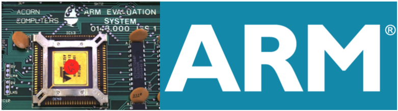
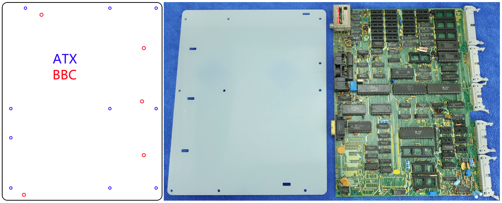
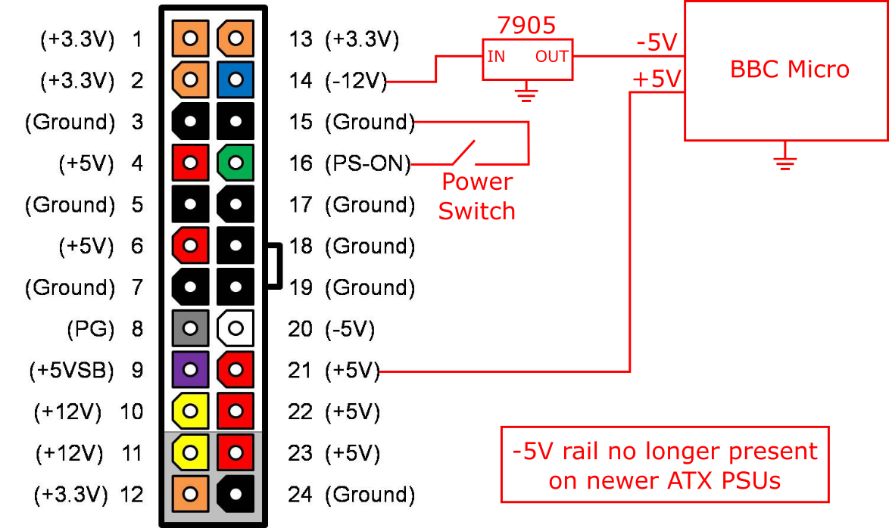
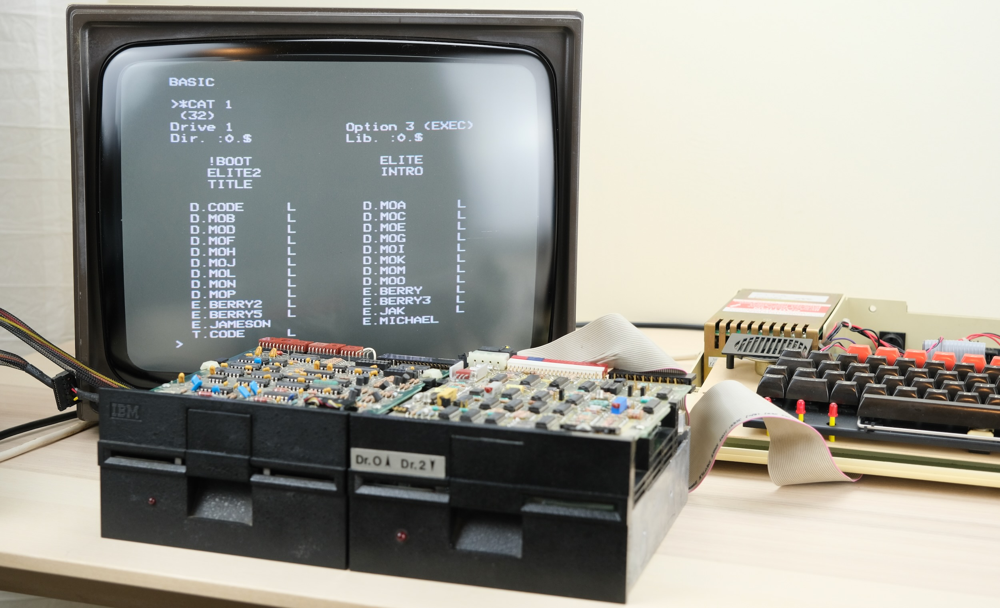
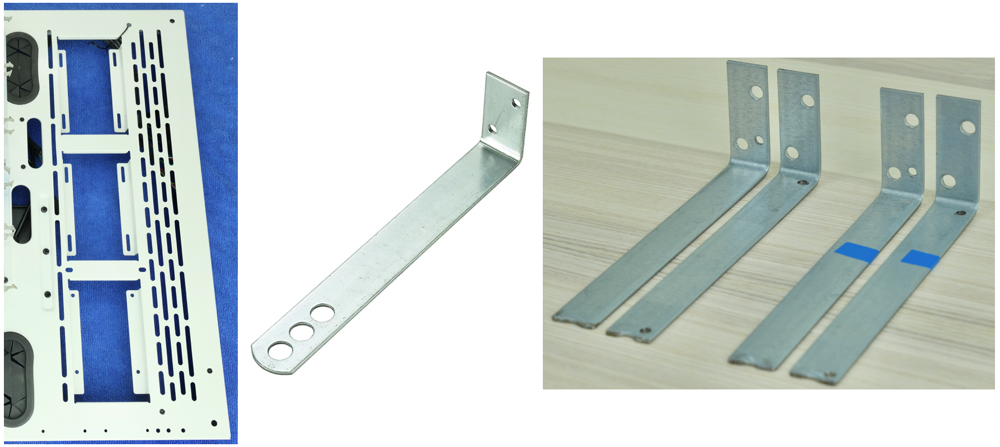
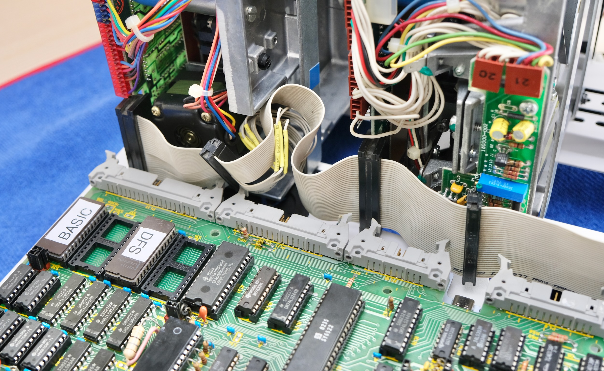

# Pimp My Beeb

BBC Micro inside a open-frame ATX PC case 

!!MEDIA TODO: Photo of completed build, big wood tabletop, HDMI monitor, modern wireless mechanical keyboard, mouse, and Xbox Series X gamepad.

!!MEDIA TODO: GIF clip of the machine in action. overview, power up, closeup of animated backlit motherboard, using modern input devices.

## Highlights

* Fully functional BBC Micro inside open-frame ATX PC case

* Animated RGB Backlight

* Working dual full-height 5.25" Floppy Drives

* USB keyboard and gamepad ([via USB4VC](https://github.com/dekuNukem/USB4VC/blob/master/README.md))

* HDMI video out ([via RGB2HDMI](https://github.com/hoglet67/RGBtoHDMI))

* SD card support (TurboMMC)

* Working soft power and reset button

## BBC Micro: (A quick) Introduction

### History and Legacy

* In early 1980s, British Broadcasting Corporation(BBC) started the *Computer Literacy Project*, aiming to introduce people to computers and show what they can do.

* **[Acorn Computer](https://en.wikipedia.org/wiki/Acorn_Computers)**'s design won out, and was developed into **[BBC Microcomputer](https://en.wikipedia.org/wiki/BBC_Micro)**, often nicknamed the "**Beeb**".

* BBC Micro was featured heavily in [TV programmes](https://en.wikipedia.org/wiki/The_Computer_Programme), and became ubiquitous in education environments in UK.

* A common sight in school computer labs, it introduced a whole generation to computing, and inspired many bright minds.

* Acorn went on to develop the **Acorn RISC Machine**, or [ARM](https://en.wikipedia.org/wiki/ARM_architecture_family) in short (Yes, *that* ARM), which are now found in virtually all smartphones, 32-bit microcontrollers, and even desktop PCs.

* It might be relatively unknown outside UK, but BBC Micro holds a significant place in computer history, as well as nostalgia in many peoples hearts!

### Specifications

### Trivias

## Oh no! You butchered a piece of important computer history!

First of all, all modifications here are **non-destructive and reversible**. So no Beebs were harmed during the creation of this project!

What's more, modifying BBC Micros was not unheard of even back then! One great example is the original [Torch Communicator](https://en.wikipedia.org/wiki/Torch_Computers):

A sleek business machine running CP/M with integrated display, keyboard, and disk drives. What's not to like?

At this point, eagle-eyed viewers might notice the UI looks suspiciously familiar! The secret is revealed looking inside the case [thanks to this video](https://www.youtube.com/watch?v=pNdYtTvEAQs):

Yep, they literally nicked the motherboard from a BBC Micro and built their own computer around it!

Despite the humble root, the Torch Communicator was a fairly advanced machine, having a Z80 co-processor running CP/M with networking capabilities, and it was the [first microcomputer](https://nosher.net/archives/computers/micro_decision_1982-05_002) to be fully approved by British Telecom to connect to the telephone and Telex network, in 1982!

Torch Computer went on to develop their [own machines](https://en.wikipedia.org/wiki/Torch_Computers#Torch_Triple_X) later. But this is a great example of building upon an existing computer to expand its capabilities.

## The FrankenBeeb

Of course, Beeb tinkering did not stop with commercial companies, plenty enterprising users had a go as well!

Here is a machine I picked up locally via ebay:

It's a Beeb with ... a separate keyboard and boxy case??

The top half of the Beeb was replaced with a flat lid. And the keyboard is in its own metal enclosure with a ribbon cable (???).

The new boxy case most likely allows the computer, disk drive and monitor to be stacked on top each other, saving valuable desk space.

A look inside revealed big upgrades, fully kitted out with sidewise expansion card, floppy disc controller, battery backup, a standalone audio jack, and speech synthesis chips. And just look at all the ROMs!

The disc drive features dual-80 track full height floppy drives, with some notes on the door:

There is no brand name or identifying information on any of the modifications, which led me to assume that the whole thing was home-made or at least from a kit.

Either way, it looks very professionally done, and is a seriously impressive feat of how far people would go to personalize their computers to their exact liking.

I removed the RIFA caps from the PSU, took lots of photos for documentation, cleaned up the PCB, and tested it out. It actually works! Look at the huge list of ROMs:

The disc drive works too! I decided not to risk the original power supply, and used a modern ATX PSU to power the drive. The FrankenBeeb read the discs just fine:

As you can see, it's quite a mess indeed. It was at this point that an idea occurred to me:

***Wouldn't it be nice if all those can go into a single ATX PC case?*** 

This way,

* Everything's in one place, cleaner look.

* Interesting juxtaposition between 40-year-old hardware and modern case.

* Very much in the spirit of wacky modding of the era.

* Honestly, why not?

## A Happy Coincidence?

Obviously, the most important part is mounting the motherboard. So I did some measurements.

Imagine my surprise when it turns out the BBC micro motherboard is **almost identical in size** as full-size ATX!

Either it's one hell of a coincidence, or Acorn was so ahead of its time that it predicted ATX form factor by **14 years**!

Still in disbelief, I placed the BBC motherboard inside a ATX case, and low and behold:

It fits almost perfectly! The RGB, cassette, serial, composite and RF ports line up with the I/O window, and there are space for all the connectors in the back! This is almost too good to be true.

Although in this particular case(!!), the PCI bracket is blocking the analogue and econet port, and the long 5.25" drive doesn't go all the way in.

Which brings us neatly to the next part: What case *should* I use?

## Case Selection

Initially, I wanted one of those absolutely obnoxious gaming cases kitted out with RGB straight out of [r/pcmasterrace](https://old.reddit.com/r/pcmasterrace/), just for maximum hilarity. Something [like this:](https://old.reddit.com/r/gamingpc/comments/jb8w25/just_rgb_everything/
)

So I went to look for a case that's:

* Available new

* Full size ATX or larger

* Gaming aesthetics (RGB, Glass panel, etc)

* Has 5.25" bays for two full-height disk drives

It didn't seem like a tall order, but after sifting through dozens of pages on amazon and newegg, I came to the devastating conclusion such case ***simply does not exist anymore***.

As you can see, apparently 5.25" bays just isn't a thing anymore! Instead there is a blank space where it used to be, to the horror of *dozens* of retro modding enthusiasts.

(yes I know there's a case with 2 bays right in that photo, but I need 4 for two drives)

-----

Just when I thought modern cases were a lost cause, I stumbled upon something I completely missed: **open-frame cases**!

Some of them are just scaffolding for mining rigs, but one in particular really caught my eye, the [Thermaltake Core P3 TG Snow](https://uk.thermaltake.com/core-p3-snow-edition.html):

* I really like its striking yet minimalist design, juxtapose neatly with the 1980s technology. It's also a nice break from today's rather bland "gaming black" aesthetics.

* It puts the motherboard on display front-and-center, instead of having to look through a window into a box in conventional cases. Less claustrophobic.

* There are lots of space to work with, and everything is modular. PCI bracket blocking the ports? Simply don't install it!

* And most importantly, the slot cutouts near the front edge are perfect for mounting 5.25" inch drives!

The clean and minimalist design also changed my mind about the overall aesthetics. Instead of full-on obnoxious RGB blast, now I kind of want something more subtle and tasteful. It's still early, so I'll see what I can do.

It's not cheap, but I really liked it, so I ordered one.

## ATX Adapter Plate

I looked up ATX standard, and measured the mounting holes on the BBC motherboard. A simple adapter plate was designed in Inkscape and laser-cut in acrylic.

The case soon arrived, I had the main chassis laid out and tried out the adapter plate:

It works! And already looks pretty good! I really like how modular this case is. 

I then installed the ATX power supply. Annoyingly the RGB fan points downwards, so it is practically invisible with the case standing up. But at least it's white!

## Power to the Beeb

BBC Micro motherboard requires two voltages: +5V and -5V. The former powers all the chips, and the latter only for sound and serial communication.

Fortunately, 5V is readily available on a ATX PSU, and -5V can be derived from -12V with a simple 7905 linear regulator. The PSU itself can be controlled by shorting the green PS_ON signal to ground.

The most basic circuit would be something like this:

One slight issue is that I want to use the power button on the PC case, which is momentary. That means I can't just hook it up to the PS_ON pin, as it will only turn on while the button is held down.

I thought about using a simple flip-flop to toggle the PWR_ON signal with button presses, and it quickly got out of hand. How about putting it on a PCB? What about button debouncing? I can put the 7905 on there too! Might as well break out ALL the voltages! A fan header would be useful! What about RGB?

## Enter ATX4VC

In the end, I decided to go all out and design a controller specifically for using **ATX power supply on retro computers**, amply named **ATX4VC**:

It combines lots of convenient features in one place:

* All common voltages: +12V, +5V, +3.3V, -5V, -12V.

* Headers for soft power button and power LED

* Temperature probe support

* Two 4-pin PWM fan headers, manual speed adjust or temperature dependent

* Two Addressable RGB(ARGB) headers

* Open-source!

Click me to buy one / more details / user manual.

Altogether, it's an all-in-one package for replacing old unreliable (and sometime explosive!) power supplies with modern ATX PSUs, with provision for cooling and aesthetic upgrades.

--------

It also fits neatly in a 2.5 inch drive bay, I hooked up the power button and LED headers, as well as a fan, and pressed the button.

It works! PSU turns on, fan spins and lights up, and voltage rails are live.

We still need to connect it to the motherboard though, which will come later.

## Did anyone say RGB?

I do want to involve some RGB in this build, usually they come from RGB fans, RAM sticks, or light strips, none of which are really suitable here:

* Beeb doesn't need fan cooling, and it's a bit silly to add them just for looks.

* Same with RGB RAM sticks

* I can try light strips, but they tend to be a bit tacky, and hard to conceal in open-frame cases

So all in all, the RGB situation wasn't looking too hot. However, I did find something much better!

----

Ground planes and large copper pours really didn't become popular until late 80s, which means the earlier circuit boards are basically translucent. If you shine a light from behind, it will illuminate the delicate and intricate design of all the traces on the PCB.

And here, I want to expand the idea by **adding RGB backlight behind the entire motherboard**, it would require a lot of LEDs, but if it looks good, it's worth the trouble in my book.

For mockup, I stuck some RGB light strips on the acrylic plate, and hastily wired them together.

Seeing it for the first time, I was in awe.

What a sight to behold! And this is just a solid white, should be even more striking with animations and more colours.

I could have just used that, but it was rather messy, so I designed a whole new custom PCB with evenly distributed RGB LEDs, that also function as the ATX adapter plate. I also left a hole in the middle so cables can exit underneath and not block the light. 

I used **USB-C** to carry the ARGB signal. Often used for charging, it is already designed to carry decent amount of current. A single cable plugs directly into ATX4VC, much cleaner this way.

This is the biggest PCB I have ever designed, it is not very complicated, but did take me a while to solder all 168 LEDs by hand. Fortunately, everything worked on first try, and it gets blindingly bright when turned all the way up!

How does it look like with the motherboard? Well:

Now **that's** what you call R, G, and B!

## USB on BBC

With power and RGB sorted, what's the next must-have item on a modern PC?

Why yes, **USB keyboard, mouse, and gamepads** of course! With such a modern case, it's only natural that I use it with modern inputs!

As if by total coincidence, I happen to have a project for *exactly that*! What are the odds?

[USB4VC](https://github.com/dekuNukem/USB4VC/blob/master/README.md) let you **use USB keyboard, mouse, and gamepads on retro computers**, as an alternative to rare, expensive, and unreliable proprietary vintage peripherals.

With a modular design, different computers are supported by swapping out **Protocol Cards**.

Naturally, I made one for the Beeb:

It supports BBC Micro keyboard, joystick, and AMX user port mouse.

The prototype has a few bodge wires, but they are fixed in the latest revision. And it works!

Pretty fun using a wireless mechanical keyboard and Xbox One controller on the Beeb!

And if for some reason you literally can't even be bothered to *type*, you can always let [duckyPad](https://github.com/dekuNukem/duckyPad/blob/master/README.md) do it!

duckyPad is a hot-swap mechanical macropad that helps speed up workflow by automating actions using duckyScript.

Read more about [USB4VC](https://github.com/dekuNukem/USB4VC/blob/master/README.md) and [duckyPad](https://github.com/dekuNukem/duckyPad/blob/master/README.md) if you're interested!

------

Phew! Two plugs in one section!

## Here comes the twist

With a flurry of modern upgrades, time to go balance it out with some good ol' 5.25" drives!

I wanted to have them from the start, partly for contrast with all the new stuff, and partly because I actually have a huge pile of floppies that I want to explore.

I picked two drives, a 48TPI Tandon TM-100-2A from an OG IBM PC, and a 96TPI Shugart SA460 from the FrankenBeeb.

With both 40 and 80 tracks, it should cover most of the floppies from the era.

After some trail and error, I found that the cable needs to have **no twists**, and drive ID set manually with jumper

I had to manually de-twist my cable by cutting and re-soldering the wires in order, which was a bit annoying, but with that and manually setting the drive ID 0 and 1, both worked!

With Intel 8271 disk controller and Acorn DFS, two sides of a floppy appear as two separate drives. So the Shugart is drive 0 and 2, and Tandon is drive 1 and 3. This disk seem to have Elite and some save data on it, very nice!

With the setup working, I now have to figure out how to mount them on the case.

The right side of the case has slots for mounting water cooling radiators, I went to local hardware store and bought some metal brackets that's roughly the size, and cut them to length and drilled holes in them.

They are screwed into the slot and hold the drives from the bottom. I really wanted something more substantial, like a one-piece metal bracket, but custom fabrication would have been a lot more expensive.

Anyway, I test-mounted the drives, and they look pretty good! The face plates line up with the front of the case.

Everything seemed to be going suspiciously well, but of course, things soon went back to normal when I tried to install the motherboard:

The connectors in the back are too long! They are touching the floppy cable, preventing the motherboard from being installed.

Well, it's about time that we do something to it...

## Motherboard modifications

This is the part where I put the motherboard under the knife (well soldering iron). As I mentioned before, all modifications are purely for aesthetic reasons, and are totally **optional and reversible**.

First, I desoldered the Tube, 1MHz, and user port header:

That was NOT easy, experience and extra care is needed to not lift any pads or damage the PCB.

Next, out comes the keyboard connector and all 7 power connector blades:

I then soldered a straight header on the user port, so I can use the excellent MMFS SD card adapter.

(I think I put it in backwards in this photo, make sure to double check!)

I then ran power cables to connect all the rails together, 5V, GND, and -5V.

I also soldered the keyboard header on the back side.

This way, the power can be plugged into ATX4VC, and keyboard ribbon cable can exit through the hole on the ATX plate so it won't block the backlight.

## Putting it all together

Time to finally put everything together! 

I fed the floppy and power cable through the hole in the adapter plate, and screwed it in.

In the back, I:

* Cable tied the USB4VC in place, and connected the ribbon cable.

* Installed two 9-Pin USB header to USB-A adapters, so USB devices can be plugged in on the front panel.

* Cable tied the speaker near the front of the case.

* Powered USB4VC with a USB-C cable.

I then connected up ATX4VC:

* Power rails on top.

* Two USB-C power output on left, one for USB4VC, one for RGB backlight plate.

* Case power button and power LED on right. Case reset button used to change RGB mode.

* ATX motherboard connector on the bottom.

It controls power, lighting and cooling of the whole system. I really like how clean and integrated this is, much better than a nest of flying wires and components.

I then installed the floppy drives, and gave it a test:

It still works! This motherboard is an issue 4, I picked it because most chips are socketed (including all RAMs), making it very easy to test and troubleshoot. The solder mask also seems thinner as well, allowing more light to pass through.

I decked it out with optional upgrades for the big day, with disk controller, speech synthesis, ADC, and econet. Annoyingly the econet chip itself is missing, and I'll need to get one.

Anyway, time to install the tempered glass for the money shot:

## Conclusion

It;s amazing how quickly a simple idea can get out of hand, I started out just wanting to put a BBC micro mnotherboard into a ATX case, and in the end I developed a new protocol card for USB4VC, a general purpose ATX controller for vintage computers, and a custom RGB backlight plate adaptor. I took this idea and really pushed to see how far I can go.

none of this it toally necessary, it is still a plain old BBC micro with a slight upgrade and some disk drives. but just like the torch computer and the frankenbeeb, the whole ordeal of dragging it kicking and screaming to the 21st centry has made it much more special, and I guess this is what modification is all about.

originality is an important part of retro computing, and many classic machines had been butchered to put newer system in them. 

however, i do find many period modifications rather charming, such as the cursed mac, and I feel that if the process is non-destructive and reversible, i woulnd mind to have a bit of fun, especially with giving a bare motherboard a home instead of having it remain as spare parts.

still, i learned a lot about the history and clever design of this machine, and devloped something that hopefully benefits the community at large. and with everything put together, it looks every bit as good as i imaghined from the beginning.

As for what's next, i might add a torch Z80 card to add CP/M capability next, but to be honest, i spent so much time building this thing, I have't had much time actually enjoying the machine itself, so I guess that's what coming up next.

much more work than i wrote, 6 revisions ATX4VC, lots of firmware devleopment, waiting for parts. 3 months

## putting it all together

## Questions and answers

can I buy one?

I'm not totally closed to commisions, but 

easier to build one yourself, all you really need is the adaptor plate, everything else is up to you, can stay completely stock or go nuts like I did.

is bbc micro pcard for sale?

not at the moment, dont see much demand, but let me know

## Make your own notes

make sure the cable you use is thick enough to carry at least 2A of current, and double check you didn't accidently cross the 5V and GND and short them. also make sure the exposed conductor is not shorting on nearby traces and components.

## Product links

duckypad
USB4VC
ATX4VC

## Other fun stuff

## Get in touch

my usual contact info

